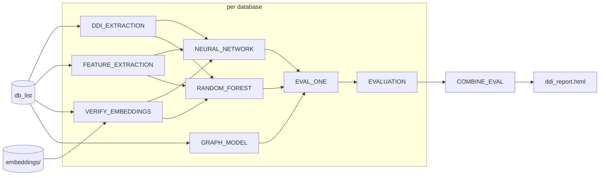

# daisybio/domainbenchmark

[](https://github.com/codespaces/new/daisybio/domainbenchmark)
[](https://github.com/daisybio/domainbenchmark/actions/workflows/nf-test.yml)
[](https://github.com/daisybio/domainbenchmark/actions/workflows/linting.yml)
[](https://www.nf-test.com)

<!-- Zenodo DOI badge will be added after the v1.0.0 release. -->


[](https://www.nextflow.io/)
[](https://github.com/nf-core/tools/releases/tag/4.0.2)
[](https://docs.conda.io/en/latest/)
[](https://www.docker.com/)
[](https://sylabs.io/docs/)
[](https://cloud.seqera.io/launch?pipeline=https://github.com/daisybio/domainbenchmark)

## Introduction

**daisybio/domainbenchmark** is a bioinformatics benchmarking pipeline for protein **domain-domain
interaction (DDI)** prediction. Given one or more pre-split DDI databases
(`train.sqlite3`, `validation.sqlite3`, and one or more `test*.sqlite3`, plus
matching embeddings — the layout [daisybio/domainsplit](https://github.com/daisybio/domainsplit)
publishes under `databases/`), the pipeline trains a panel of machine-learning
and graph-based predictors, evaluates each one against every held-out test
split, and produces a unified MultiQC report comparing them.

A database with an internal test set ships **two** test splits,
`test_balanced.sqlite3` and `test_realistic.sqlite3`. Both are benchmarked
against the *same* trained models: DDI extraction, feature extraction and model
fitting run once per database, and only scoring and evaluation fan out. Each
test split is then reported as its own dataset — `random_balanced`,
`random_realistic` — with its own curves, table rows and heatmap entries.

The pipeline runs the following stages:

1. **DDI extraction** from the database split (`DDI_EXTRACTION`).
2. **Feature extraction** for every requested encoding computed here
   (`aacomp`, `aaencode`, `dummy`) —
   parallelized per `(feature × split)`.
3. **ML classifiers** trained on each feature individually plus one
   all-feature concatenation run (gated by `--machine_learning_models`):
   - `NEURAL_NETWORK` — neural network (PyTorch + skorch).
   - `RANDOM_FOREST` — RAPIDS cuML random forest on GPU.
4. **Graph models** (`GRAPH_MODEL`): KGIDDI, DDI parsimony, KGIDDI-random.
5. **Per-prediction evaluation** (`EVAL_ONE`) → tiny per-model JSONs.
6. **Per-database aggregation** (`EVALUATION`) → MultiQC report.
7. **Cross-database aggregation** (`COMBINE_EVAL`) when `--db_list` is set.




## Usage

> [!NOTE]
> If you are new to Nextflow and nf-core, please refer to [this page](https://nf-co.re/docs/get_started/environment_setup/overview) on how to set-up Nextflow. Make sure to [test your setup](https://nf-co.re/docs/get_started/run-your-first-pipeline) with `-profile test` before running the workflow on actual data.

### Samplesheet (recommended entry)

```bash
nextflow run . \
    -profile <docker/apptainer/singularity/conda> \
    --input assets/samplesheet.csv \
    --outdir results
```

The samplesheet is a CSV with one row per database split:

```csv
id,db_path
random_denoise,/path/to/random_denoise
random_ddi,/path/to/random_ddi
```

Schema in `assets/schema_input.json`. Each `db_path` must contain
`train.sqlite3`, `validation.sqlite3`, and one or more `test*.sqlite3`.

### Directory (no samplesheet)

`--input` also accepts a directory — every immediate subdirectory holding a
`train.sqlite3` becomes a dataset named after the directory, which is exactly
what domainsplit publishes:

```bash
nextflow run . \
    -profile <docker/apptainer/singularity/conda> \
    --input /path/to/domainsplit/results/databases \
    --outdir results
```

```
databases/
├── random/                    train, validation, test_balanced, test_realistic
├── random_hcni/               same positives, high-confidence negatives
├── minimal_leakage/           train, validation, test_balanced, test_realistic
├── minimal_leakage_hcni/
├── external_test/             train, validation, test
└── external_test_hcni/
```

A `<method>` / `<method>_hcni` pair is the same positive split with the
negatives redrawn from a high-confidence candidate network, so the two runs are
a controlled comparison in which only the negatives differ. Each is reported as
its own dataset.

### Embeddings

domainsplit embeds the cut domain sequence once per run and publishes one
mean-pooled vector per domain instance:

```
embeddings/
├── esm3_domain_embeddings.h5
├── esmc_domain_embeddings.h5
└── prott5_domain_embeddings.h5
```

The `esm3_embeddings`, `esmc_embeddings` and `prott5_embeddings` features read
those files instead of extracting anything, so `--embeddings` is required
whenever they are enabled:

```bash
nextflow run . \
    --input  /path/to/domainsplit/results/databases \
    --embeddings /path/to/domainsplit/results/embeddings \
    --outdir results
```

`--embeddings` may be left off when `--input` is a directory: domainsplit
publishes `embeddings/` as a sibling of `databases/`, so the pipeline looks one
level up from `--input` and errors only if no such directory is there. A
samplesheet input still needs it explicitly, because its rows can point at
several runs.

These files are keyed `h5[pfam_id][instance_id]` and are per **run**, not per
split: one file holds every domain the run saw, and each split database is a
subset of that, so it serves `train`, `validation` and every `test*` split of
the databases the same run produced.

Nothing downstream notices when a file does not fit: the loader skips the
`(pfam_id, instance_id)` pairs it cannot resolve, so an ill-fitting file yields
zero training rows rather than an error. `VERIFY_EMBEDDINGS` therefore checks
each file against the databases before any model is trained — the domain
instances must actually resolve.

That check cannot tell one *run* from another: Pfam accessions are stable, so an
export made by a different run over the same domains resolves like a native one.
Nothing guards against that, deliberately — with `--embeddings` derived from
`--input` the pairing is right by construction, and if you set `--embeddings`
yourself, or use a samplesheet, pointing it at the matching run is on you.

### Cluster

This repo carries no executor profile. The executor, queues, work directory and
GPU `clusterOptions` come from the institutional config passed with `-c`; on
DaiSyBio that is `daisybio.config` (also available as a `daisybio` profile from
[nf-core/configs](https://github.com/nf-core/configs)):

```bash
nextflow run . \
    -c daisybio.config \
    -profile apptainer,gpu,keep_work \
    --input assets/samplesheet.csv \
    --outdir /nfs/scratch/cobinet/results \
    -resume
```

`gpu` adds `--nv` to the container runtime and is what routes `process_gpu`
tasks (NEURAL_NETWORK, RANDOM_FOREST) to the GPU queue. `keep_work` is
important: `daisybio.config` sets `cleanup = true`, which deletes the work
directory on a successful run and makes a later `-resume` start from scratch.

### Skipping stages

`--skip` accepts a comma-separated list of feature names or graph-model
names. For example, to skip the heavy embedding-based features and the
two parsimony graph models:

```bash
nextflow run . \
    -c daisybio.config \
    -profile apptainer,gpu,keep_work \
    --input assets/samplesheet.csv \
    --skip "kgiddi,ddiparsimony,esm3_embeddings,esmc_embeddings,prott5_embeddings"
```

### Test profile (in-repo fixture)

```bash
nextflow run . -profile test,singularity --outdir results-test
```

The `test` profile points at the tiny in-repo fixture under `tests/data/` --
databases plus the published embedding files that go with them -- and runs one
extracted feature (`aacomp`) and one published one (`esm3_embeddings`).
Regenerate it with `python tests/create_test_data.py --out tests/data/databases`.
Used by CI and by `nf-test`.

## Pipeline parameters

| Parameter | Default | Description |
|---|---|---|
| `--input` | `null` | **Required.** Samplesheet CSV (one row per database), or a directory of database directories. |
| `--outdir` | `./results` | Output directory. |
| `--modeljson` | `${projectDir}/assets` | Directory of model hyperparameter JSONs. |
| `--skip` | `''` | Comma-separated feature/model names to skip. |
| `--graph_models` | `kgiddi,ddiparsimony,kgiddi_random` | Graph models to run. |
| `--machine_learning_features` | `dummy,aacomp,aaencode,esm3_embeddings,esmc_embeddings,prott5_embeddings` | Feature encodings fed to the classifiers. |
| `--published_features` | `esm3_embeddings,esmc_embeddings,prott5_embeddings` | Of those, the ones read from `--embeddings` instead of extracted from the databases. |
| `--embeddings` | `null` | domainsplit's `results/embeddings/` directory. Needed when `--published_features` is non-empty, but derived from `--input` when that is a directory (one level up, `embeddings/`). |
| `--large_features` | `esm3_embeddings,esmc_embeddings,prott5_embeddings` | Features routed to the heavy memory-time envelope. |
| `--machine_learning_models` | `neural_network,random_forest` | ML models to run. |
| `--seed` | `42` | Master RNG seed. Reaches every randomised step, including workers in a process pool -- see [Reproducibility](#reproducibility). |
| `--allow_cpu_ml` | `false` | Let `RANDOM_FOREST` train with scikit-learn when no GPU is usable, instead of exiting 140 for a retry on another GPU node. For GPU-less machines (CI, laptops); the `test` profile sets it. |
| `--ppi_score_cutoff` | `400` | Minimum STRING `combined_score` a PPI must reach to enter the interactome every graph model builds on. |
| `--mqc_order` | `null` | Comma-separated dataset order for the MultiQC reports, e.g. `random_balanced,minimal_leakage_hcni_realistic,external_test`. Orders the per-dataset sections, the dataset tabs inside the combined plots, and the heatmap columns. A name that matches no dataset is a hard failure; a dataset missing from the list warns and is appended alphabetically. |
| `--publish_dir_mode` | `'copy'` | Nextflow `publishDir` mode. |

Full schema with defaults, types, and descriptions: `nextflow_schema.json`.
Run `nextflow run . --help` for a CLI summary.

### Overriding numeric parameters

`--seed`, `--ppi_score_cutoff` and `--min_embedding_coverage` are declared with
their types in the `params { }` block at the top of `main.nf`, so
`--seed 7 --ppi_score_cutoff 900 --min_embedding_coverage 0.8` works on the
command line.

That block is load-bearing. Nextflow's v2 (strict) parser, the default since
26.x, no longer infers types for command-line parameters: `--seed 7` arrives as
the string `"7"` and parameter validation rejects it with
`Value is [string] but should be [integer]`. **A new numeric or boolean
parameter has to be declared there too, or it cannot be set from the CLI.**
A `-params-file` (YAML/JSON) preserves types on its own and needs no
declaration.

## Pipeline output

For each database split processed, a subdirectory under `--outdir/<db_name>/`:

```
<outdir>/<db_name>/
├── ddi/
│   └── DDI/
│       ├── <split>.csv            # domain pairs + label
│       ├── <split>_instances.csv  # the split's domain-instance pairs
│       └── <split>_sources.csv    # domain pairs + provenance list
├── data/
│   ├── <feature>__train.h5
│   ├── <feature>__validation.h5
│   └── <feature>__<test_split>.h5
├── nn_output/
│   └── neural_network_<feature_combo>/
│       ├── predictions_<variant>.parquet   # one per test split
│       └── model/
├── rf_output/
│   └── random_forest_<feature_combo>/
│       ├── predictions_<variant>.parquet
│       └── model/
├── graph_models/
│   └── <model_name>/
│       ├── predictions_<variant>.parquet
│       └── model/
└── evaluation/
    └── <variant>/                          # one report per test split
        ├── ddi_report.html
        └── source_accuracy.json            # per-source accuracy, for COMBINE_EVAL
```

Shared work (DDI CSVs, features, fitted models) sits directly under the
database directory; only `evaluation/` fans out per test variant. A top-level
cross-database report is always written to `<outdir>/evaluation/ddi_report.html`
and lists every (database, test variant) pair as a separate dataset.

That combined report also carries an **Accuracy by DDI source** section: one bar
group per source (`3did`, `sampled_negative`, `single_domain_ppi`, `PPIDM*`,
`negatome`, …), one bar per model plus an `Average` bar, and a tab per
(database, variant) with a final `Combined` tab pooling them all. A DDI whose
`source` lists several sources counts under each of them, so the groups overlap
and do not sum to the `ALL` group. Sources are usually single-class -- `3did` is
all positives, `sampled_negative` all negatives -- so accuracy is the only
metric reported; the DDI counts per source sit in the section description,
together with a note for any model that scored less than the full source.

A full description of each output is in [`docs/output.md`](docs/output.md).

## Reproducibility

Two runs of the same commit, on the same input, with the same `--seed` produce
byte-identical DDI tables, feature files, trained models, predictions and
metrics. The only outputs that differ are MultiQC's own report metadata
(`ddi_report.html` and parts of `ddi_report_data/`), which embed a run
timestamp, absolute work-dir paths and the MultiQC version.

What that takes, beyond passing `--seed` around:

- **`PYTHONHASHSEED=0`**, set for every task in the `env` scope of
  `nextflow.config`. Python salts string hashing per interpreter, so iterating
  a `set` of domain IDs gave a different order every run -- which reordered
  training rows, the class-balancing draw, and the rows of a predictions
  parquet. It cannot be fixed from inside Python: the salt is chosen before the
  interpreter starts.
- **`bin/determinism.py`**. `seed_everything(seed)` seeds `random`, `numpy` and
  `torch`, turns off cuDNN autotuning, and asks torch for deterministic
  kernels. `derive_seed(seed, *tokens)` gives a stable child seed for anything
  that runs in a worker: a process pool inherits no RNG state, and a worker
  must not be seeded from its completion order.
- **Per-fit reseeding.** `RandomizedSearchCV` runs the neural-network
  candidates with `n_jobs > 1`, in joblib worker *processes*. A skorch
  `on_train_begin` callback reseeds inside the worker, which is the only point
  a seed can still reach weight init, dropout masks and batch order.
- **Single-stream cuML.** `RandomForestClassifier(n_streams=1)`: with more
  streams the GPU forest builder reduces histograms in a nondeterministic
  order, and `random_state` does not pin it. The CPU fallback used under
  `--allow_cpu_ml` takes `n_jobs=1` for the same reason -- sklearn accumulates
  per-tree probabilities under joblib, so `predict_proba` depends on thread
  scheduling in its last bits. That is enough to move the MCC-tuned decision
  threshold, and to perturb the scores the hyperparameter search ranks by.
- **Sorted channel groups.** `groupTuple()` and `collect()` emit in
  task-completion order, and that order became `eval_multiqc.py`'s argument
  order -- which MultiQC writes straight into its JSON. Grouped lists are
  sorted before they reach a script, which also keeps task hashes stable for
  `-resume`.
- **`PYTHONDONTWRITEBYTECODE=1`.** Tasks get `bin/` on PATH from the pipeline
  directory itself, so they would otherwise write `__pycache__` back into it and
  the pipeline directory would carry state between runs.

`nf-test` asserts all of this: `tests/default.nf.test` snapshots the contents
of the model and prediction files, so a run that stops being reproducible fails
CI. If a library bump legitimately moves the numbers, regenerate the snapshot --
do not add exclusions to `tests/.nftignore`, which would also hide real
regressions. Graph models are disabled in the `test` profile (they are far too
slow for CI), so their seeding is not covered by the snapshot.

## Profiles

| Profile | Effect |
|---|---|
| `standard` | Local executor + conda. Default. |
| `docker` | Local executor + docker. |
| `singularity` | singularity container engine. |
| `apptainer` | apptainer container engine. |
| `conda` | Forces conda; disables docker / singularity. |
| `gpu` | Adds `--nv` / `--gpus all` to the container runtime. On a cluster it is also what the institutional config keys on to send `process_gpu` tasks to the GPU queue. |
| `test` | Tiny in-repo fixture for smoke tests and `nf-test`. |
| `test_full` | Full-data CI run (large fixtures). |

## Adding new components

### New feature encoding

Copy the template and implement your feature computation:

1. Copy `bin/features/new_feature.py` to `bin/features/<your_feature>.py`
2. Implement `extract_features(conn, out_file)` — read from SQLite, write feature vectors to HDF5
3. Append `<your_feature>` to `params.machine_learning_features` in `nextflow.config`
4. If it needs GPU or large memory, also add it to `params.large_features`

See `bin/features/new_feature.py` for the full contract and examples.

For a feature that is *not* computed here — one domainsplit already published
under `--embeddings` — there is no Python file to write. Add the name to both
`params.machine_learning_features` and `params.published_features`, and put the
HDF5 in the embeddings directory as either `<your_feature>.h5` or
`<model>_domain_embeddings.h5`. It skips `FEATURE_EXTRACTION` entirely: the file
is per *run*, not per split, so one copy serves `train`, `validation` and every
`test*` split of the databases that run produced.

### New ML model

Copy the template and implement your training/prediction logic:

1. Copy `bin/new_model.py` to `bin/<your_model>.py`
2. Subclass `DDIModelTrainer` and implement the required methods
3. Create `assets/<YourModel>.json` with hyperparameter grid (must include `model_name`, `data`, `search_parameters`, `model_parameters`)
4. Add a Nextflow process in `modules/local/<your_model>/main.nf` and wire it into `subworkflows/local/per_db_benchmark/main.nf`

See `bin/new_model.py` for the full API and optional overrides.

## Credits

daisybio/domainbenchmark was originally written by Konstantin Pelz, Chiara Thomas, Christian Romberg.

We thank the following people for their extensive assistance in the development of this pipeline:

- Amelie Hilbig

## Contributions and Support

If you would like to contribute to this pipeline, please see the [contributing guidelines](docs/CONTRIBUTING.md).

## Citations

A Zenodo DOI for daisybio/domainbenchmark will be issued at the v1.0.0
release; this section will be updated then. An extensive list of
references for the tools used by the pipeline can be found in the
[`CITATIONS.md`](CITATIONS.md) file.

This pipeline uses code and infrastructure developed and maintained by the [nf-core](https://nf-co.re) community, reused here under the [MIT license](https://github.com/nf-core/tools/blob/main/LICENSE).

> **The nf-core framework for community-curated bioinformatics pipelines.**
>
> Philip Ewels, Alexander Peltzer, Sven Fillinger, Harshil Patel, Johannes Alneberg, Andreas Wilm, Maxime Ulysse Garcia, Paolo Di Tommaso & Sven Nahnsen.
>
> _Nat Biotechnol._ 2020 Feb 13. doi: [10.1038/s41587-020-0439-x](https://dx.doi.org/10.1038/s41587-020-0439-x).
