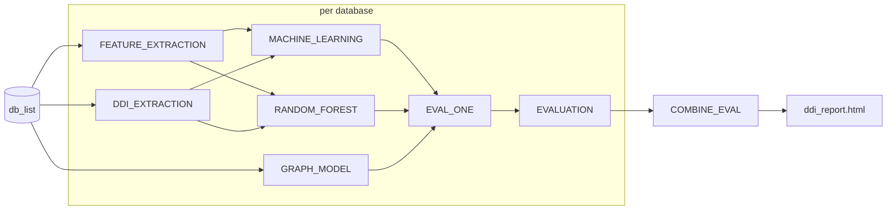

# daisybio/domainbenchmark

[](https://github.com/codespaces/new/daisybio/domainbenchmark)
[](https://github.com/daisybio/domainbenchmark/actions/workflows/nf-test.yml)
[](https://github.com/daisybio/domainbenchmark/actions/workflows/linting.yml)[](https://doi.org/10.5281/zenodo.XXXXXXX)
[](https://www.nf-test.com)

[](https://www.nextflow.io/)
[](https://github.com/nf-core/tools/releases/tag/4.0.2)
[](https://docs.conda.io/en/latest/)
[](https://www.docker.com/)
[](https://sylabs.io/docs/)
[](https://cloud.seqera.io/launch?pipeline=https://github.com/daisybio/domainbenchmark)

## Introduction

**daisybio/domainbenchmark** is a bioinformatics benchmarking pipeline for protein **domain-domain
interaction (DDI)** prediction. Given one or more pre-split DDI databases
(`train.sqlite3`, `test.sqlite3`, `optimization.sqlite3` plus matching
embeddings), the pipeline trains a panel of machine-learning and
graph-based predictors, evaluates each one against a held-out test split,
and produces a unified MultiQC report comparing them.

The pipeline runs the following stages:

1. **DDI extraction** from the database split (`DDI_EXTRACTION`).
2. **Feature extraction** for every requested encoding (`aacomp`,
   `aaencode`, ProtT5 / ESM-3 / ESM-C protein and domain embeddings) —
   parallelized per `(feature × split)`.
3. **ML classifiers** trained on every feature combination up to
   `--max_machine_learning_features`:
   - `MACHINE_LEARNING` — neural network (PyTorch + skorch).
   - `RANDOM_FOREST` — RAPIDS cuML random forest on GPU.
4. **Graph models** (`GRAPH_MODEL`): KGIDDI, DDI parsimony, KGIDDI-random.
5. **Per-prediction evaluation** (`EVAL_ONE`) → tiny per-model JSONs.
6. **Per-database aggregation** (`EVALUATION`) → MultiQC report.
7. **Cross-database aggregation** (`COMBINE_EVAL`) when `--db_list` is set.




<!-- TODO nf-core: Include a figure that guides the user through the major workflow steps. Many nf-core
     workflows use the "tube map" design for that. See https://nf-co.re/docs/community/brand/workflow-schematics#examples for examples.   -->

## Usage

> [!NOTE]
> If you are new to Nextflow and nf-core, please refer to [this page](https://nf-co.re/docs/get_started/environment_setup/overview) on how to set-up Nextflow. Make sure to [test your setup](https://nf-co.re/docs/get_started/run-your-first-pipeline) with `-profile test` before running the workflow on actual data.

### Single database

```bash
<<<<<<< HEAD
nextflow run main.nf \
    -profile <singularity/docker/conda> \
    --db /path/to/database_split \
    --outdir results
=======
nextflow run daisybio/domainbenchmark \
   -profile <docker/singularity/.../institute> \
   --input samplesheet.csv \
   --outdir <OUTDIR>
>>>>>>> TEMPLATE
```

### Multiple databases (scatter + combined evaluation)

```bash
nextflow run main.nf \
    -profile <singularity/docker/conda> \
    --db_list "/path/to/db1,/path/to/db2,/path/to/db3" \
    --outdir results
```

### Cluster (Slurm + Singularity)

```bash
nextflow run main.nf \
    -profile slurm,singularity \
    --db_list "/nfs/data/CoBiNet_Masterpraktikum/databases/random_denoise,..." \
    --outdir /nfs/scratch/cobinet/results
```

### Skipping stages

`--skip` accepts a comma-separated list of feature names or graph-model
names. For example, to skip the heavy embedding-based features and the
two parsimony graph models:

```bash
nextflow run main.nf \
    -profile slurm,singularity \
    --skip "kgiddi,ddiparsimony,prott5_protein_domain_embeddings,esm3_protein_domain_embeddings"
```

### Test profile (in-repo fixture)

```bash
nextflow run main.nf -profile test,singularity --outdir results-test
```

The `test` profile points `--db` at a tiny in-repo SQLite triple under
`tests/data/` and disables every heavy feature except `aacomp`. Used by
CI and by `nf-test`.

## Pipeline parameters

| Parameter | Default | Description |
|---|---|---|
| `--input` | `null` | Optional samplesheet CSV (one row per database split). |
| `--db` | `null` | Path to a single database split directory. |
| `--db_list` | `null` | Comma-separated list of database splits. |
| `--outdir` | `./results` | Output directory. |
| `--modeljson` | `${projectDir}/assets` | Directory of model hyperparameter JSONs. |
| `--skip` | `''` | Comma-separated feature/model names to skip. |
| `--graph_models` | `kgiddi, ddiparsimony, kgiddi_random` | Graph models to run. |
| `--machine_learning_features` | `aacomp, aaencode, prott5_*, esm3_*, esmc_*` | Feature encodings to compute. |
| `--max_machine_learning_features` | `2` | Max features combined per ML run. |
| `--seed` | `42` | Global RNG seed. |
| `--publish_dir_mode` | `'copy'` | Nextflow `publishDir` mode. |

Full schema with defaults, types, and descriptions: `nextflow_schema.json`.
Run `nextflow run main.nf --help` for a CLI summary.

## Pipeline output

For each database split processed, a subdirectory under `--outdir/<db_name>/`:

```
<outdir>/<db_name>/
├── data/
│   └── <feature>/
│       ├── train.h5
│       ├── test.h5
│       └── optimization.h5
├── ml_output/
│   └── <feature_combo>/
│       ├── predictions.parquet
│       └── model/
├── rf_output/
│   └── random_forest_<feature_combo>/
│       ├── predictions.parquet
│       └── model/
├── graph_models/
│   └── <model_name>/
│       ├── predictions.parquet
│       └── model/
└── evaluation/
    └── multiqc_report.html
```

When `--db_list` is set, a top-level cross-database report is also written:
`<outdir>/evaluation/ddi_report.html`.

A full description of each output is in [`docs/output.md`](docs/output.md).

## Profiles

| Profile | Effect |
|---|---|
| `standard` | Local executor + conda. Default. |
| `docker` | Local executor + docker. |
| `singularity` | Local executor + singularity / apptainer. |
| `conda` | Forces conda; disables docker / singularity. |
| `slurm` | Slurm executor with GPU labels and retry-on-OOM. Pairs with `singularity` on the cluster. |
| `test` | Tiny in-repo fixture for smoke tests and `nf-test`. |
| `test_full` | Full-data CI run (large fixtures). |

## Adding new components

- **New ML model:** add `assets/<Name>.json` (with `model_name`, `data`,
  `search_parameters`, `model_parameters`) and the matching script in
  `bin/`. The pipeline picks up the JSON automatically.
- **New feature encoding:** add `bin/features/<name>.py` and append
  `<name>` to `params.machine_learning_features` in `nextflow.config`.

## Credits

daisybio/domainbenchmark was originally written by Konstantin Pelz, Chiara Thomas, Christian Romberg.

We thank the following people for their extensive assistance in the development of this pipeline:

- Amelie Hilbig

## Contributions and Support

If you would like to contribute to this pipeline, please see the [contributing guidelines](docs/CONTRIBUTING.md).

## Citations

<!-- TODO nf-core: Add citation for pipeline after first release. Uncomment lines below and update Zenodo doi and badge at the top of this file. -->
<!-- If you use daisybio/domainbenchmark for your analysis, please cite it using the following doi: [10.5281/zenodo.XXXXXX](https://doi.org/10.5281/zenodo.XXXXXX) -->

An extensive list of references for the tools used by the pipeline can be found in the [`CITATIONS.md`](CITATIONS.md) file.

This pipeline uses code and infrastructure developed and maintained by the [nf-core](https://nf-co.re) community, reused here under the [MIT license](https://github.com/nf-core/tools/blob/main/LICENSE).

> **The nf-core framework for community-curated bioinformatics pipelines.**
>
> Philip Ewels, Alexander Peltzer, Sven Fillinger, Harshil Patel, Johannes Alneberg, Andreas Wilm, Maxime Ulysse Garcia, Paolo Di Tommaso & Sven Nahnsen.
>
> _Nat Biotechnol._ 2020 Feb 13. doi: [10.1038/s41587-020-0439-x](https://dx.doi.org/10.1038/s41587-020-0439-x).
